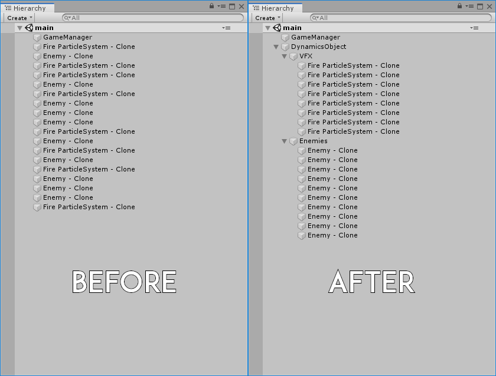

# DynamicsObjects

## How to use
After each new instantiated game object, we have to call our DynamicsObjects.

~~~~
[SerializeField] private GameObject _prefab;

void Start()
{
	GameObject newGaleObject = Instantiate(_prefab);
	newGaleObject.transform.SetParent(DynamicsObjects.ParentType.VFX);
	DynamicsObjects.Instance.SetToParent(newGaleObject.transform, "projectile");
}
~~~~

### Overview

